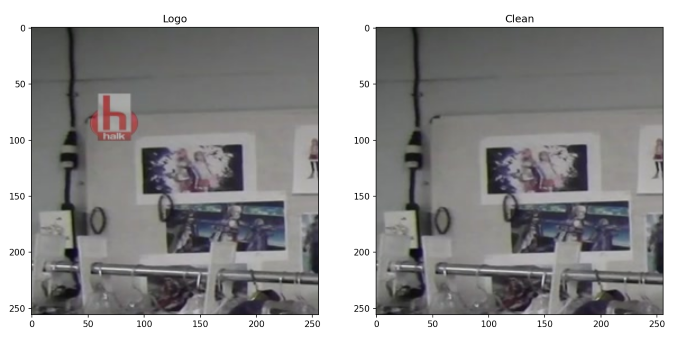
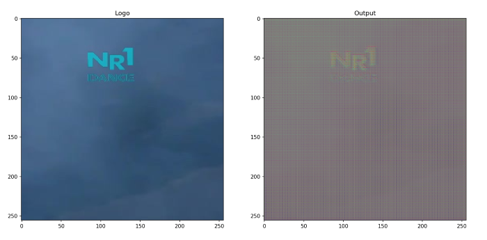
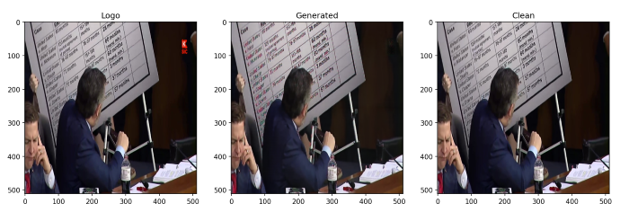
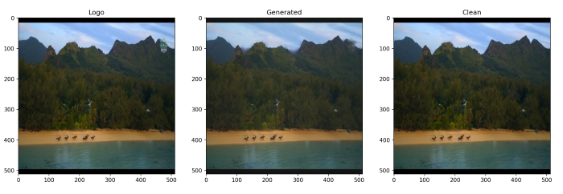
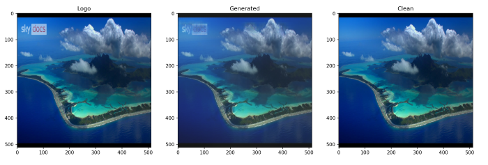
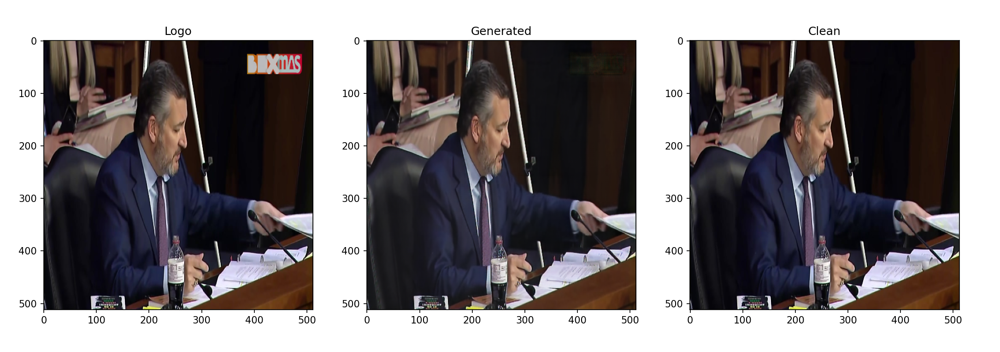
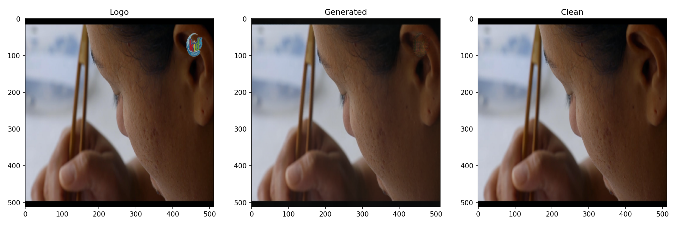
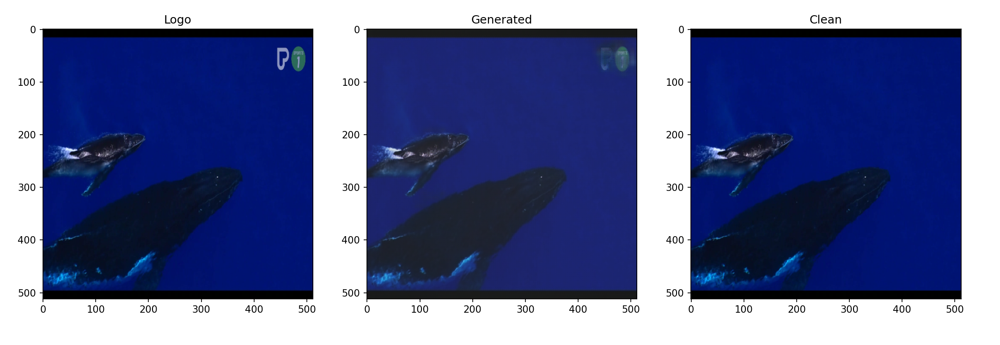

# TV- channel logo removal

<br>

The goal of the assignment is to create a neural network capable of removing TV channel logo from the input image.

<br>
 
 ## Dataset
- images with logo in folder ```'images/logo'``` have pattern: ```'i-j-k.jpg'```
- images without logo in folder ```'images/clean'``` have pattern: ```'i-j.jpg'```
- **Note**: one clean image is having multiple corresponding logo images

<br>

Paths to images are firstly divided into train and validation sets (70/30)
```python
# get lists of paths to corresponding images (split 70/30)
train_logo_paths, val_logo_paths, train_clean_paths, val_clean_paths = get_paths()
```

<br>

Argument ```patches``` in ```Dataset``` class can define whether the images are divided into patches or not. 
```python
train_dataset = Dataset(train_logo_paths, train_clean_paths, patches = True)
```

When called, each pair of images  ```logo```, ```clean``` is normalized and returned as tensor (when ```patches = True```, list of tensors is returned and the length of the list represents number of patches for each image)

<br>

Run  ```dataset.py```  to load first iteration of dataloader and visualize the ```logo``` and ```clean``` images as well as to understand how the batch size and the number of patches change the dimension of returned tensors.



```
> Size of training set:  3138
> Size of validation set:  1345

> Size of logos after concatenation: torch.Size([100, 3, 256, 256])
> Number of patches for each image: 10
> Batch size: 10
```

<br>

## Model 

Consists of:
- generator 
- discriminator


<br>

### Generator

U-net structure with 7 down-sampling convolutional layers (*encoder*), bottleneck and 7 up-sampling (*decoder*) transposed-convolutional layers with relu activation function followed by final convolution layer with tanh activation function. 

<br>

Dimensions after each layer can be seen below (where 20 represents the batch size):


```
Original:  torch.Size([20, 3, 256, 256])
D1:  torch.Size([20, 64, 128, 128])
D2:  torch.Size([20, 128, 64, 64])
D3:  torch.Size([20, 256, 32, 32])
D4:  torch.Size([20, 512, 16, 16])
D5:  torch.Size([20, 512, 8, 8])
D6:  torch.Size([20, 512, 4, 4])
D7:  torch.Size([20, 512, 2, 2])
B:  torch.Size([20, 512, 1, 1])
U1:  torch.Size([20, 512, 2, 2])
U2:  torch.Size([20, 512, 4, 4])
U3:  torch.Size([20, 512, 8, 8])
U4:  torch.Size([20, 512, 16, 16])
U5:  torch.Size([20, 256, 32, 32])
U6:  torch.Size([20, 128, 64, 64])
U7:  torch.Size([20, 64, 128, 128])
Out:  torch.Size([20, 3, 256, 256])
```

<br>

### Discriminator

Basic CNN with 4 convolutional layers with batch normalization and leaky relu activation function followed by final convolutional layer with a sigmoid activation function. 

<br>

Dimensions after each layer can be seen below (where 20 represents the batch size):

```
Original:  torch.Size([20, 3, 256, 256])
Conv1:  torch.Size([20, 64, 128, 128])
Conv2:  torch.Size([20, 128, 64, 64])
Conv3:  torch.Size([20, 256, 32, 32])
Conv4:  torch.Size([20, 512, 16, 16])
Conv5:  torch.Size([20, 1, 13, 13])
Out:  torch.Size([20, 1])
```

<br>

Run  ```model.py``` to perform one forward operations of both models and visualize input and output of the generator net.



```
> Batch size:  3
> Number of patches for each image:  10
> Logos size:  torch.Size([30, 3, 256, 256])
> Fake images size:  torch.Size([30, 3, 256, 256])
> Clean image size:  torch.Size([30, 3, 256, 256])
> Discriminator output of generated size:  torch.Size([30, 1])
> Discriminator output of cleans size:  torch.Size([30, 1])
```

<br>

## Training

There are two options:
- generator only
- GAN

<br>

Models are saved after every epoch into the folder ```/checkpoints``` and the plots visualizing the losses re saved into the folder ```/plots```. 

<br>

### Generator only

The generator is trained to transform input ```logo``` images into output ```generated``` images that are compared with ```clean``` images by the ```nn.MSELoss()``` criterion. This loss allows the network to minimize image distortion and at the same time reduce the noise, i.e. watermark within the image.

As the image is processed from one layer to another it is also compressed in size. This allows the encoder network to extract most significant features from the image. As the encoder's capacity decreases it learns to disregard certain features and compress others. The decoder will then do the work backwards by rebuilding the image to its initial state without having the logo while maintaining the quality of the image. 

<br>

Run ```main_generator_only.py``` to train the network.

Pattern for saving the generator model (after each epoch) is:
```python
f"checkpoints/AUTOG-B{setup.BATCH}-G-{setup.GLR}-E{epoch+1}.pt"

```
```
...
>T_Epoch: [1/14], Step: [0/1046], Loss: 0.172
...
```

<br>

### GAN

Generator and discriminator are playing a minimax game. Discriminator (which acts like a CNN image classifier) is trying to distinguish between ```generated``` (= **0**) and ```clean``` (= **1**) images while generator makes the discriminator classify its output (```generated``` images) as ```clean``` (= **1**).

<br>

Learning of discriminator consists of:

```python
           
   outputs = discriminator(cleans)
   d_loss_real = torch.nn.BCELoss(outputs, torch.ones((logos.shape[0], 1)))

   generated_images = generator(logos)
   outputs = discriminator(generated_images.detach())
   d_loss_fake = torch.nn.BCELoss(outputs, torch.zeros((logos.shape[0], 1)))

   d_loss = (d_loss_real + d_loss_fake)/2
            
```

<br>

Generator is learning by getting feedback from its own net as well as by incorporating the feedback from the discriminator:

```python
           
    g_loss_mse = torch.nn.MSELoss(generated_images, cleans)
    outputs = discriminator(generated_images)
    g_loss_bce = torch.nn.BCELoss(outputs, torch.ones((logos.shape[0], 1)))
            
    g_loss = setup.LAMBDA*g_loss_mse + g_loss_bce
            
```

<br>

Run ```main_GAN.py``` to train the network.

Pattern for saving the generator model (after each epoch) is:
```python
f"checkpoints/G-B{setup.BATCH}-G-{setup.GLR}-D-{setup.DLR}-{setup.LAMBDA}MSE-E{epoch+1}.pt"
```

```
...
> T_Epoch: [2/17], Step: [1000/1046]  |  D_R: 0.750, D_F: 0.621 |  G_MSE: 0.258, G_BCE: 0.762  |  D_avg_Loss: 0.686  G_avg_Loss: 1.020 
> V_Epoch: [2/17], Step: [0/449], D_avg_Loss: 0.697,  G_avg_Loss: 1.539 
...
```

<br>

## Results

Run ```show.py``` to visualize the results. 

<br>

Examples tested on model: ```AUTOG-B5-G-0.00015-E20.pt``` (observed ratio 3 good: 1 bad):

 
 
 

<br>

Examples tested on model: ```G-B4-G-0.0002-D-0.0003-50MSE-E20.pt``` (observed ratio 3 good: 1 bad):

 
 
 

<br>

In the folder ```/tested_imgs``` you can find more examples.

<br>

## Setup

Check the ```setup.py``` file to adjust parameters, both for training and visualizing the data. 

```python
           
class Setup(object):
    
    def __init__(self):

        self.DEVICE = torch.device("cuda:0")
        
        # path to the directories containing the clean and logo images
        self.clean_dir = os.path.join(os.path.expanduser('~'), 'NN_projects', 'LogoRemoval', 'images', 'clean') 
        self.logo_dir = os.path.join(os.path.expanduser('~'), 'NN_projects', 'LogoRemoval', 'images', 'logo') 
        
        # if patch = True in Dataset()
        self.patch_size = (256,256)
        
        # if patch = False in Dataset()
        self.whole_size = (512,512)
        
        # training parameters for main,py
        # also parameters defining trained model for show.py
        self.BATCH = 3
        self.EPOCHS = 14
        self.GLR = 0.0002
        self.DLR = 0.0002
        self.LAMBDA = 100
        
        # few extra parameters for show.py
        self.AUTO = False
        self.BATCH_show = 10
            
```

<br>

## Remarks and final comments

Training the models is highly sensitive on the hyperparameters. In most of the images, the logo is relatively small, therefore one has to be very careful when choosing the learning rates as well as the coefficient lambda to prevent the generator simply copying the whole input image as output (especially when splitting the image into multiple patches, resulting in having fewer images that actually have the logo in them). 

Few of the models trained can be found [here](https://drive.google.com/drive/u/1/folders/1cOSs3fYkM9J2yIWk8yTKRFc7jgtGv5vK) (as the size was too much big to upload in the repository). All the models were trained on training dataset with patches of size ```(256, 256)```, resulting in 10 patches for each image. The visualized results in ```/tested_imgs``` were tested on validation dataset without patches with the images of size ```(512, 512)```. 

I believe better results can be obtained by further exploring different variations of the parameters. 

The approach of calculating the losses (especially adding the parameter lambda for the generator's loss) was inspired by the [pix2pix model](https://github.com/junyanz/pytorch-CycleGAN-and-pix2pix).


